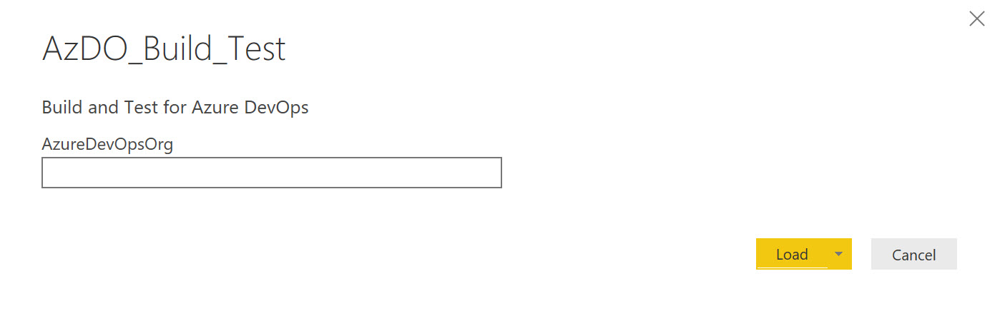
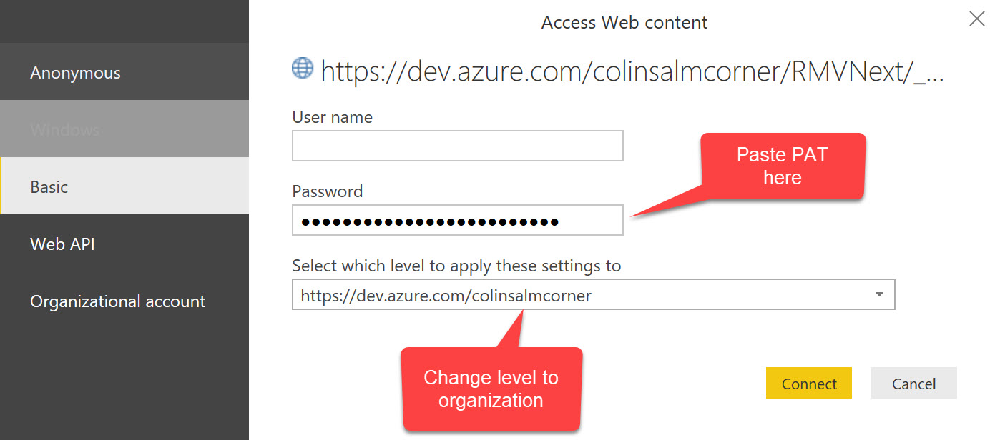
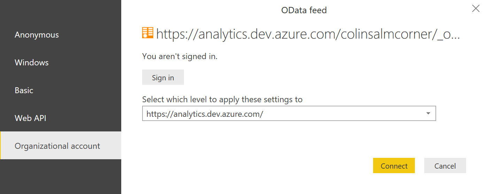

# Azue DevOps Build and Test PowerBI Template
This PowerBI template allows you to report off builds for the last two weeks, including queue information, test information and coverage information.

## Connecting
There is a parameter (Azure DevOps Organization) and two connections that you need to authenticate.

### Specifying the Azure DevOps Organization
When you open the PBIT, you will be prompted for your Azure DevOps Organization. Type in the name of your org (so if you connect to `https://dev.azure.com/myorg`, type `myorg`).

### Access Web Content Connection
The REST API calls are authenticated by a personal access token (PAT). When the authentication pops up for Web Content, click on Web API method. Paste your PAT into the password box and update the dropdown for "level" to `https://dev.azure.com/<myorg>`.

### Access OData Connection
The OData feed is authenticated via organizational credentials. Click on Org Credentials, set the dropdown to  and sign in.

